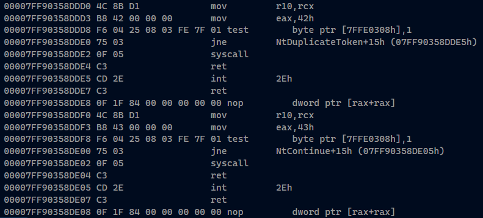
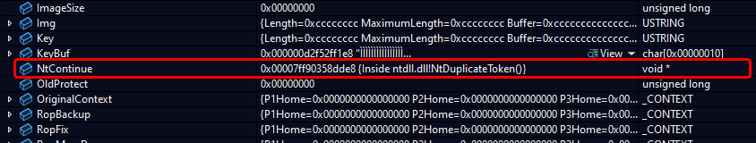
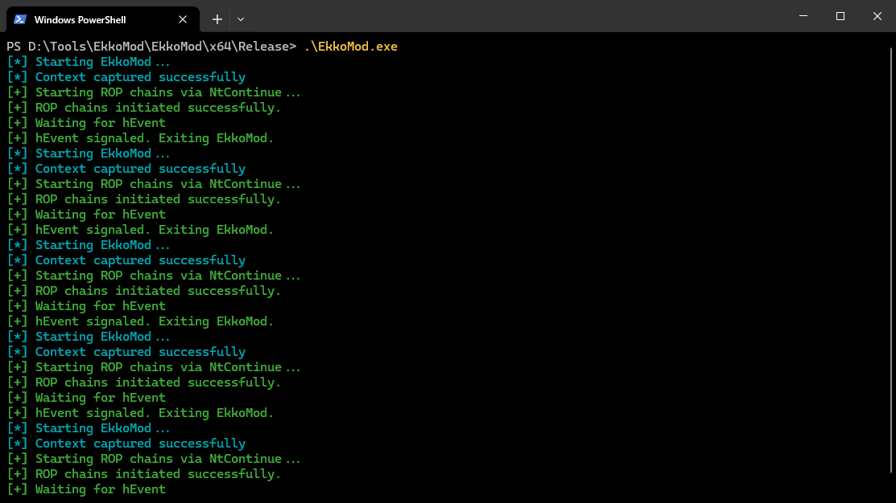
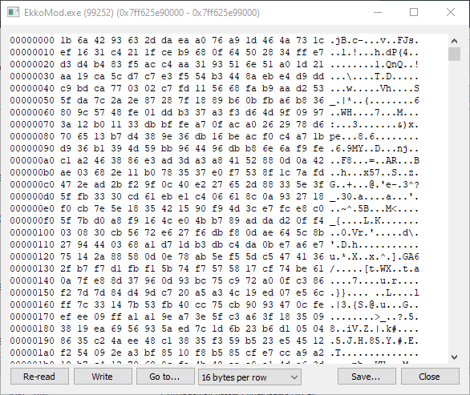
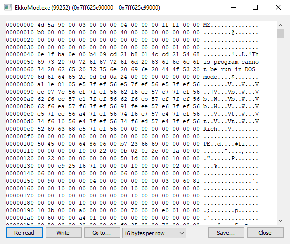
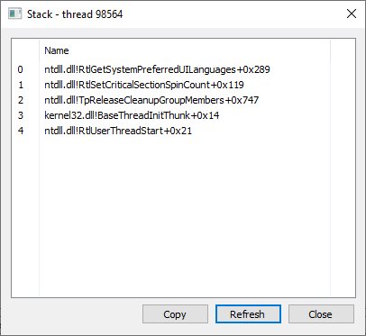
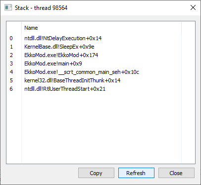
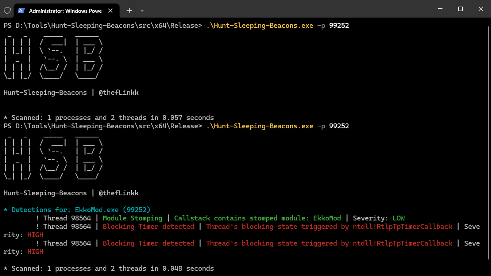
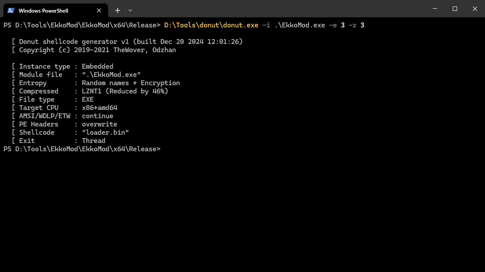
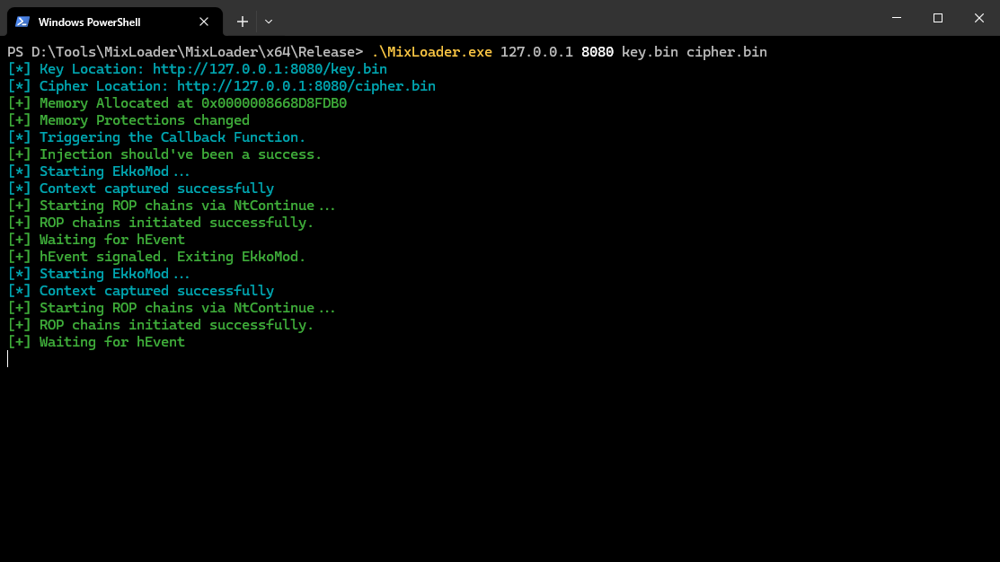

# EkkoMod
This is a PoC for a simple sleep function that encrypts the image during sleep, spoofs the sleeping callstack statically and points the callbacks of timers to 8 Bytes before the NtContinue syscall stub which is essentially a `nop`

# Research
## Previous Research
The initial code for [Ekko](https://github.com/Cracked5pider/Ekko) was modified by [Dylan Tran](https://github.com/susMdT) to include static call stack spoofing to beat [HuntSleepingBeacons](https://github.com/thefLink/Hunt-Sleeping-Beacons) and their detection. However, over time they must have added more detections which are what this sample aims to beat.

## Detections
The critical detections in previous versions of [Sleep Obfuscation](https://github.com/JodisKripe/SleepObfuscation) were talking about a timer pointing to NtContinue. 

> Note: The CallStackSpoofing sample already goes one step ahead of the [Ekko](https://github.com/Cracked5pider/Ekko) base by including static call stack spoofing following the research of [Dylan Tran](https://github.com/susMdT). However now even it gets detected due to "Timers with callbacks pointing to NtContinue".

## Approach
So my instinctive thoughts were to find a way to not make it point directly to NtContinue. Initially I was going to create a jmp routine to NtContinue or a different subroutine that will be a wrapper over NtContinue, but I soon realised that whatever I write will get encrypted when sleep is going on. So there are some more ways to do this which would be:
1. Create an external library having those subroutines.
2. Figure out a way to not encrypt that subroutine/Encrypt most of the binary and not that subroutine and surrounding stuff.
3. Find another way to point to NtContinue for execution without actually pointing it there.

Debugging my the CallStackSpoofing code, I realised that there indeed is a way to do this via the 3rd option. 

As is visible, the syscall stub right before the NtContinue stub end with `0F 1F 84 00 00 00 00 00` which is a representation for `nop` or "no operation". 
So, in theory if timer's callback pointer points to these few bytes(starting from `0F`), it will be in the address space of `NtDuplicateToken` and moreover when the execution begins, the first thing that will happen is a `nop` followed by execution of NtContinue. 

So just by adding a `NtContinue = (PBYTE)NtContinue - 0x08` to the code, HSB no longer thinks that this is callback is pointing to NtContinue, but we do execute NtContinue nonetheless.
Therefore HSB is beat (for now). 

# Working

This binary sleeps in an obfuscated manner for 4 seconds, wakes up does some task (for example do a genuine sleep of 1000 milliseconds) and repeats. 

In memory, the process is encrypted when the "Sleep" is going on.  

When the process does some work (in our case, does a regular sleep), the image in memory is unencrypted. 

The call stack looks generic(duplicated from a callback thread) when sleep is underway 

The stack looks normal when functions are being performed since the memory is unencrypted. 

The only detection Hunt Sleeping Beacons has is when the process in unencrypted, which in the grand scheme of things can be a very short time with huge "sleep" intervals. 

> Note: In a live EDR environment, you would definitely need dynamic call stack spoofing to make sure this does not get detected in general even when it is unencrypted and stuff. I am yet to do that, but this is a shortcoming which has been overcome by other pre-existing methods.

# How can this be further weaponised ?
A sample having this function for sleep can be converted into shellcode using something like [donut](github.com/TheWover/donut) or use the [StarDust](https://github.com/Cracked5pider/Stardust) template and then loaded using a shellcode loader like [MixLoader](https://github.com/JodisKripe/MixLoader) which will inherit the "sleep obfuscation" functionality on runtime due to how it is designed.

eg. 

### Donut

### MixLoader

### The whole image sleeps

# Note for everyone
This sample is made public to display research and development while also marking learning milestones. This is only meant to aid the defenders in creating better detection methods. Any other unintended use is the responsibility of the user.

# Issue raised
Should have a new detection to evade in a few days :)

Issue raised w [HSB](https://github.com/thefLink/Hunt-Sleeping-Beacons/issues/4)
